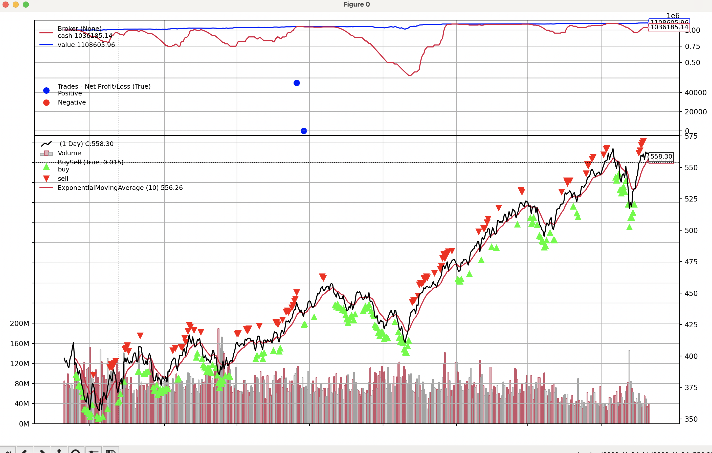

# Backtests

Project was to test a backtesting library/tool 

Makes api calls out to polygon.io for stock data, then runs some algorithms and code to generate a backtest of a trading strategy based on Expoential moving average time series trend lines. Kinda okay likely not realistic but interesting.

Trading strategy is to trade in tiny frations and only buy and almost never sell. Presumption is SPY always goes up due to current financial system, crashes happen but stonks always goes up. Inflation, pension funds etc. over a long period of time there is a lot of driving force to lift the market index. 

We can see the tests show this automatic trading strategy, which is a simple rule based around exponential moving average executes buy trades during dips and sells near peaks. Only major drawdown in portfolio is during a crash-like scenario as the buy and selling algorithm in place is to buy in tiny fractions into dips as the market declines. Once a certain max percentage of the portfolio is used up in buying stock then it stops purchases. 

The benefit in my eyes to this approach is typically having an algorithm buying into "troughs" and not "peaks", overal portfolio allocation is a lot lower on averae during normal market conditions so risk overall is lower but the overal gains made is lower than the market average. This would be good to test in more choppy market conditions/data.

Max draw down is around 80% of portfolio value but typical drawdowns is a lot lower than that.

Only goes back 2-3 years of data which is nothing. Only noticeable drop was around COVID 2020-ish about 30-40% drop in market but then money printer.

